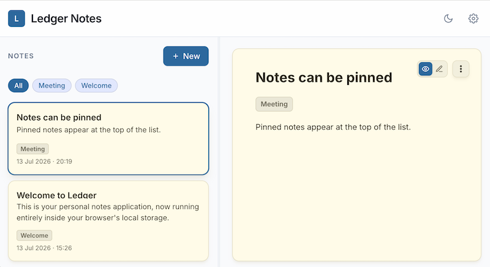

# Ledger — Notes

A single-file, local-first Markdown note-taking web app. Open `ledger-notes.html` in a browser — no build step or server required. Notes are saved to your browser's `localStorage`.



## Features

- **Local-first & Private**: Notes and app preferences are stored immediately in browser `localStorage`. No account or backend server required.
- **Rich Markdown Support**: Full GitHub Flavored Markdown (GFM) support for headings, bold, italic, lists, and admonition callouts (`[!NOTE]`, `[!TIP]`, `[!WARNING]`, `[!IMPORTANT]`, `[!CAUTION]`).
- **Formatting Toolbar & Smart Lists**: Quick formatting toolbar for common syntax, plus automatic list and task checkbox continuation on `Enter`.
- **Interactive Checkboxes**: Toggle task list checkboxes directly in View Mode without opening the editor.
- **Pinning**: Pin key notes to the top of the list.
- **Tags & Filtering**: Add tags to notes with autocomplete support and filter notes by one or multiple active tags.
- **Resizable Sidebar**: Drag the sidebar edge to customize width; layout dimensions are saved automatically.
- **Themes & Time Format**: Supports light/dark themes with automatic OS preference detection and manual toggle, plus configurable 12-hour or 24-hour timestamp formats.
- **Keyboard Shortcuts**:
  - `Cmd/Ctrl + .` — Create a new note
  - `Cmd/Ctrl + Enter` — Save and switch to View mode
  - `Enter` — Continue bulleted and task lists in the editor

## Getting Started

### Add a note

To add a note:

- Click the **+** button in the header or press `Cmd/Ctrl + .`.
- Type your content using Markdown.
- Add tags in the editor tag field for easy filtering.
- Press `Cmd/Ctrl + Enter` or click the View mode button to preview.

### Edit a note

To edit a note:

- Select a note preview card in the sidebar.
- Double-click the note card or rendered preview, or click the Edit mode toggle button.
- Edit the content; changes autosave automatically.
- Press `Cmd/Ctrl + Enter` or click View mode when finished.

### Pin a note

To pin or unpin a note:

- Click the pin icon on any note card in the sidebar to keep it at the top of your list.

### Delete a note

To delete a note:

- Select the note.
- Open the **...** menu in the top-right of the note header and select **Delete note**.
- Confirm deletion when prompted.

## Export / Import

Open **Settings** (gear icon in the header) to back up or restore your notes.

- **Export all notes** — saves every note to a single Markdown file (`ledger-notes-export.md`).
- **Import all notes** — loads notes from an exported Markdown file. This **overwrites** existing notes after confirmation.

### Export file format

Each note is exported as a Markdown block with YAML-style frontmatter headers containing metadata (`id`, `tags`, `lastModified`, `pinned`), separated by a `<!-- ledger-note -->` marker:

```markdown
<!-- ledger-note -->
---
id: note-1718000000000
tags: meetings, work
lastModified: 1718000000000
pinned: true
---

# Meeting notes

Your markdown content goes here.
```

Because notes are plain Markdown, exported files remain portable and readable in any standard text or Markdown editor.
